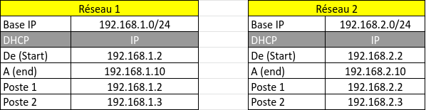
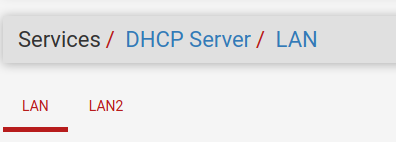
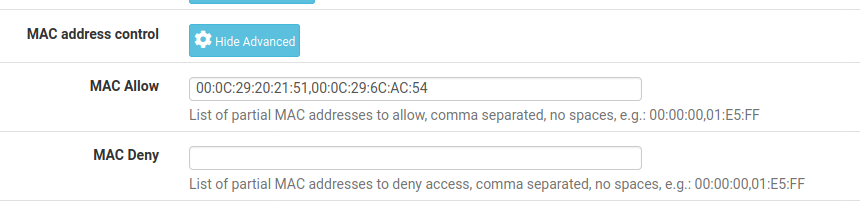
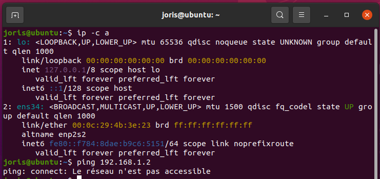

# Projet Infra & SI

<h3> Addario Clément & Pader Joris 
<h3> Groupe n°23
<h3> B1 Informatique Ynov Toulouse

# Projet n°2 : ROUTEUR
<h2> Mise en place d’un routeur qui gère les différentes zones réseaux d’une petite entreprise (avec certaines fonctionnalités additionnelles, en plus du routage simple).

# Configuration PfSense

## Installation de pfSense

Tout d'abord :  
  
1) Démarrer la machine avec l’iso de PfSense
2) Laisser l'autoboot (par défaut)
4) Sélectionnez: "Install pfSense"
5) Sélectionner: "French keymap" & "Continue"
6) Partitioning: "Auto(UFS) BIOS"
7) Manual Config: "No"
8) Reboot et éjecter l’image du disque
  

## Configuration de pfSense

Après le reboot on arrive donc sur l'écran de menu. On va effectuer une configuration basique pour l'instant, celle-ci nous permettra d'accéder à l'interface web d'administration.   
  
1) Option 1 : Assign Interfaces
    - Définir VLANs maintenant ? : "n"
    - Renseigner interface WAN (em0) et l'interface LAN (em1)
    - Valider : "y"

2) Option 2 : Set Interface(s) IP address
    - Selectionner l'interface WAN
    - DHCPv4 ? : "y"
    - DHCPv6 ? : "n"
    - <Enter> pour pas d'IPv6
    - Revert to HTTP ? : "n"
    - <Enter> pour continuer  

3) Option 2 : Set Interface(s) IP address
    - Select l'interface LAN
    - Entrez l'adresse IPV4 : 192.168.1.1
    - Entrez le masque : 24
    - <Enter> pour pas mettre de gateway
    - <Enter> pour pas mettre d'IPv6
    - DHCP server ? : "y"
    - Adress range : 192.168.1.2 - 192.168.1.10
    - Revert to HTTP ? "no"
    - <Enter> pour continuer
  
Nous pouvons désormais accéder à l'interface web d'administration depuis le LAN à l'adresse `192.168.1.1`.  
  

Lors de la première connexion, vous serez guidé pour une première configuration.

1) Suivre le setup
2) General Information :
    - Renseigner hostname, domain et DNS
    - Laisser cocher "Override DNS"
3) Régler la localisation et l'heure
4) Configurer l'interface WAN
5) Configurer l'interface LAN
5) Modifier le mdp admin
6) Reload & Finish  
  
Normalement avec le schéma et la configuration actuelle, toutes les machines devraient pouvoir se ping et accéder à Internet.  
  
De plus, toutes les machines ont accès au serveur DNS du routeur, et ce dernier récupère les serveurs DNS du WAN (grâce à l'option "Override DNS").

Voici donc le schéma de notre réseau : 

Voici le plan d’adressage de l’entreprise :

## Activation DHCP

Il faut maintenant activer le DHCP sur les interfaces du routeur.  
De retour sur l'interface d'administration : 
"Services" > "DHCP Server" > "OPT1"   

Activez le DHCP sur l'interface, spécifiez le range d'adresses et validez.     
Les machines ont maintenant une IP attribuée automatiquement suivant leur VLAN.   

  
Configuration de la liste des ip mac autorisés par le DHCP 
On a autorisé 2 adresse MAC “00:0C:29:20:21:51” & “ 00:0C:29:6C:AC:54” 

Pc qui essaie de se connecter a comme adresse MAC : 
“00:0C:29:4b:3e:23”. Elle n’est pas entrée dans le serveur DHCP, donc elle n’a pas accès au réseau comme nous pouvons le voir. 

## Activation SquidGuard

(source : https://www.pc2s.fr/pfsense-proxy-transparent-filtrage-web-url-squid-squidguard/)

SquidGuard est un système de filtrage d’URL permettant de filtrer les accès à Internet à l’ensemble des utilisateurs connectés au réseau.

Installation : 

1) Dans Available Packages, rechercher “squid” puis installer les 3 packages.
2) Une fois installé, créez un certificat pour le filtrage en HTTPS
3) Sélectionner “Services” et “SquidGuard Proxy Filter”
4) Activer SquidGuard “Enable”
5) Activer “Enable Log” et “Enable log rotation”
6) Activer “Enable Blacklist” et insérer dans Blacklist URL : 
    http://dsi.ut-capitole.fr/blacklists/download/blacklists_for_pfsense.tar.gz
7) Puis sauvegarder.
8) Dans l’onglet Blacklist, cliquer sur “ Download” pour installer tous les filtres.

### Paramétrage des règles
1) Action ‘Pass’
2) Interface “Wan”
3) Source “ Single Host or alias”
4) Destination “Wan address”
5) Destination port range “HTTPS
6) Log Activer pour avoir les log journaliers
7) Description : AJouter une description pour la règle 

